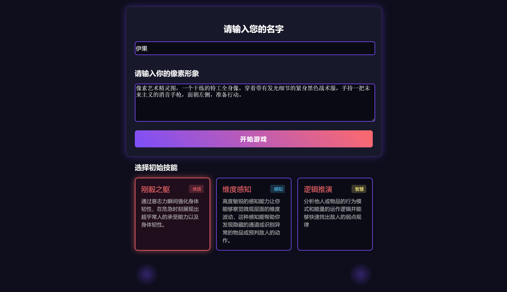
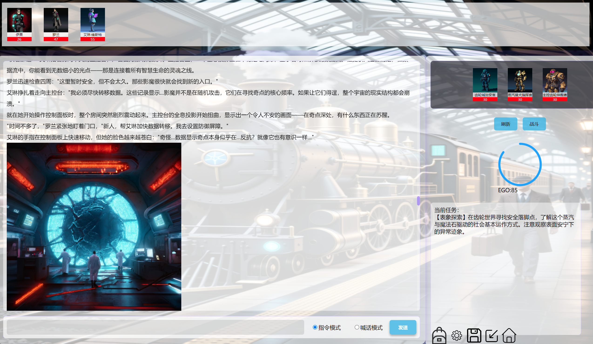

# MCP驱动的AI智能角色扮演游戏



## 项目简介

这是一个基于MCP（Model Context Protocol）架构的AI驱动角色扮演游戏，使用Node.js和Electron开发。游戏通过智能AI系统实现了动态世界观构建、NPC自主行为和丰富的剧情互动。

## 技术架构

- **MCP Server端** (`MCP_Server/`) - 游戏核心逻辑服务器
- **AI Client端** (`MCP_Client/`) - AI模型交互客户端  
- **用户界面端** (`MCPGame/`) - Electron桌面应用界面

## 核心功能

### AI智能游戏系统

- 📖 动态更新世界观设定
- 🌍 场景穿越与地图切换
- 🎭 智能NPC添加与管理
- ⚔️ 实时战斗系统
- ❤️ 角色状态动态调整
- 🎒 物品与技能系统
- 📋 任务系统管理
- 📢 NPC行为广播
- 🏁 多结局生成
- 🎨 文生图提示词生成

### NPC自主行为系统

- 🎭 动态人设调整
- ⚔️ 阵营背叛与敌对
- 🤝 队友关系建立

## 安装与运行

### 环境要求

- Node.js 16+
- 大语言模型API（用于主对话）
- 小语言模型API（用于敌人刷新和提示词生成）
- 通义万相API（文生图功能，可选）

### 快速开始

```bash
# 安装依赖
cd MCP_Server && npm install
cd ../MCP_Client && npm install  
cd ../MCPGame && npm install

# 启动服务
cd MCP_Server && npm run dev
cd MCP_Client && npm run dev
cd MCPGame && npm run dev
```

### 打包

```bash
# 使用pkg打包MCP Server&Client
cd MCP_Server && npm run package
cd MCP_Client && npm run package
# Electron打包
cd MCPGame && npm run build:win
```

## 游戏模式



### 🎮 指令模式

将玩家的行动指令传递给AI进行逻辑处理和剧情推进

### 📢 喊话模式  

将玩家的语言广播给所有NPC和队友，触发群体反应

### 💬 NPC私聊

进入特定NPC的子页面进行深度对话和关系培养

## 当前挑战与改进方向

### 缺陷与优化方向

1. **对话系统融合** - NPC的对话与主对话无法严丝合缝地契合。我想要在游戏中添加“自我值”的设定，让主对话变为玩家角色的感知滤镜，所以不能简单地将主对话的内容给到NPC
2. **AI行为引导** - AI总喜欢“哄”玩家（比如玩家想要观察周围是否有伤员，那么AI就一定会给出一个“伤员”）
3. **剧情节奏控制** - AI对剧情长度不可控，且有时会生成一些较为“无趣”的片段
4. **信息权重优化** - 每次给到AI的信息量过多（世界观信息以及工具函数信息）且权重相等，导致某些信息被选择性忽视

### 代码质量

作为开发者的第一个Node.js和Electron项目，代码可能存在优化空间。
同时我个人的提示词工程能力有限，或许这也导致了上述的各个问题。
